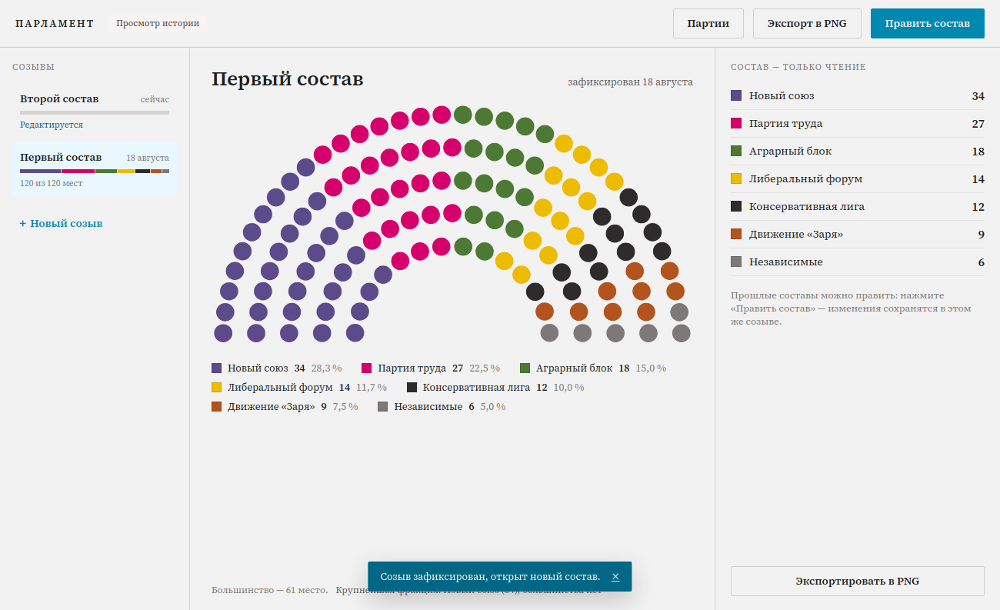
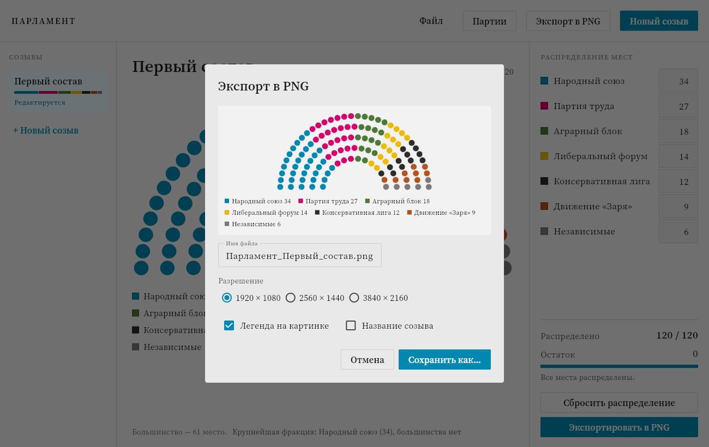

# Парламент

Десктопное приложение для наглядного отображения состава парламента в ролевой
игре: справочник партий, распределение 120 мест, полукруглая схема зала,
история созывов и экспорт картинки в PNG.


## Что умеет

- **Справочник партий** — название, сокращение и цвет (готовая палитра, ввод
  HEX или подбор по RGB). Правки расходятся по всем созывам, где партия
  участвует.
- **Распределение мест** — по полю ввода на партию; схема, легенда, остаток и
  полоса прогресса пересчитываются на лету. Сумму нельзя увести выше 120,
  отрицательные числа и буквы не принимаются.
- **Созывы** — «Новый созыв» фиксирует текущий состав в истории и открывает
  следующий. Любой прошлый созыв можно открыть, посмотреть и при желании
  поправить — правки сохраняются в него же.
- **Экспорт в PNG** — 1920×1080, 2560×1440 или 3840×2160, с легендой и
  названием созыва по выбору.
- **Файл проекта** — всё хранится в одном JSON-файле и сохраняется само после
  каждого изменения. Через «Файл» можно завести отдельный файл под каждую игру.

## Как запустить

Нужен Python 3.10 или новее.

```bash
pip install -r requirements.txt
python main.py
```

### Тесты

```bash
python -m unittest discover -s tests
```

80 тестов: бизнес-логика (валидация мест, справочник, созывы, файл проекта),
геометрия схемы, экспорт PNG и сам интерфейс — экраны и диалоги прогоняются
через настоящий `ParlamentApp` на подставной странице (`tests/fake_page.py`),
без запуска окна.

### Сборка под Windows

```bash
flet build windows
```

Готовое приложение появится в `build/windows`. Для сборки нужен Flutter SDK и
Visual Studio с рабочей нагрузкой «Разработка классических приложений на C++»
— требования самого Flet, см. [его документацию](https://flet.dev/docs/publish/windows).

## Архитектура

Один процесс Python: Flet рисует окно, бизнес-логика вызывается напрямую —
ни сети, ни межпроцессного обмена.

```
main.py                     точка входа, путь к файлу проекта
parlament/
  model.py                  партия, созыв, проект; сериализация в JSON
  store.py                  файл проекта: чтение и атомарная запись
  service.py                операции и валидация; автосохранение
  ui/
    app.py                  состояние, экраны, действия
    parties_view.py         справочник партий
    dialogs.py              диалоги: партия, удаление, созыв, экспорт, справка
    seat_chart.py           геометрия полукруглой схемы и Canvas
    export.py               отрисовка PNG (Pillow)
    theme.py                токены дизайн-системы Broadsheet
    format.py               склонения, проценты, даты
    mount.py                безопасное обновление контролов
assets/fonts/               Source Serif 4 — приложению не нужен интернет
```

Слой данных (`model`, `store`, `service`) не знает про Flet: его можно
покрыть тестами и переиспользовать под любым интерфейсом.

**Геометрия схемы.** Места лежат на пяти концентрических дугах между
внутренним и внешним радиусом. Мест в ряду — пропорционально длине дуги,
остаток от округления достаётся рядам с наибольшей дробной частью; внутри
ряда места стоят через равный угол, затем все сортируются по углу слева
направо и последовательно красятся цветами партий. Расчёт (`compute_seats`)
отделён от отрисовки, поэтому окно и экспорт в PNG показывают одно и то же.

**Перерисовка.** Смена вида, созыва или списка партий пересобирает экран
целиком; ввод числа мест обновляет только зависимые части (схема, легенда,
сводка, список созывов) — на схеме 240 фигур, и перестраивать всё окно на
каждое нажатие клавиши было бы заметно.

## Формат файла проекта

Обычный JSON в UTF-8 — его можно читать и править руками:

```json
{
  "schemaVersion": 1,
  "totalSeats": 120,
  "rows": 5,
  "parties": [
    { "id": "p1a2b3", "name": "Народный союз", "color": "#0088b0", "abbr": "НС" }
  ],
  "convocations": [
    {
      "id": "c9f8e7",
      "number": 1,
      "name": "Первый состав",
      "seats": { "p1a2b3": 34 },
      "createdAt": "2026-03-12T10:00:00+00:00",
      "fixedAt": "2026-05-04T18:30:00+00:00"
    }
  ]
}
```

Запись атомарная (через временный файл рядом с целевым), так что сбой посреди
сохранения не оставит обрезанный файл. Если файл всё же испортился,
приложение запустится с чистым проектом и скажет об этом.

Файл по умолчанию:

| ОС | Путь |
|---|---|
| Windows | `%APPDATA%\Parlament\parlament.parlament.json` |
| macOS | `~/Library/Application Support/Parlament/…` |
| Linux | `~/.local/share/Parlament/…` |

## Экраны

| | |
|---|---|
|  |  |
| Справочник партий | Создание и правка партии |
|  |  |
| Просмотр истории | Экспорт в PNG |

Пример готовой картинки: [`docs/screenshots/export-result.png`](docs/screenshots/export-result.png).

## Решения по открытым вопросам ТЗ

Раздел 9 технического задания оставлял пять вопросов открытыми. Решения,
заложенные в реализацию:

1. **Правка прошлых созывов** — разрешена. Архивный созыв открывается только на
   чтение, кнопка «Править состав» снимает защиту; правки сохраняются в тот же
   созыв, новый не создаётся.
2. **Удаление созыва** — не реализовано (в макетах явно вне области работ).
   История только пополняется. Добавить несложно: операция удаления с
   перенумерацией в `service.py`, дальше вызов из левой панели.
3. **Имя файла при экспорте** — подставляется автоматически по шаблону
   `Парламент_<Название созыва>.png`, поле редактируемое.
4. **Партии между созывами** — остаются в справочнике, даже если в новом составе
   не получили мест. Справочник живёт отдельно от созывов.
5. **Максимум партий** — жёсткого ограничения нет: легенда переносится по
   строкам, а в экспорте строки центрируются, так что читаемость сохраняется и
   на полутора десятках партий.

## Лицензия

MIT.
