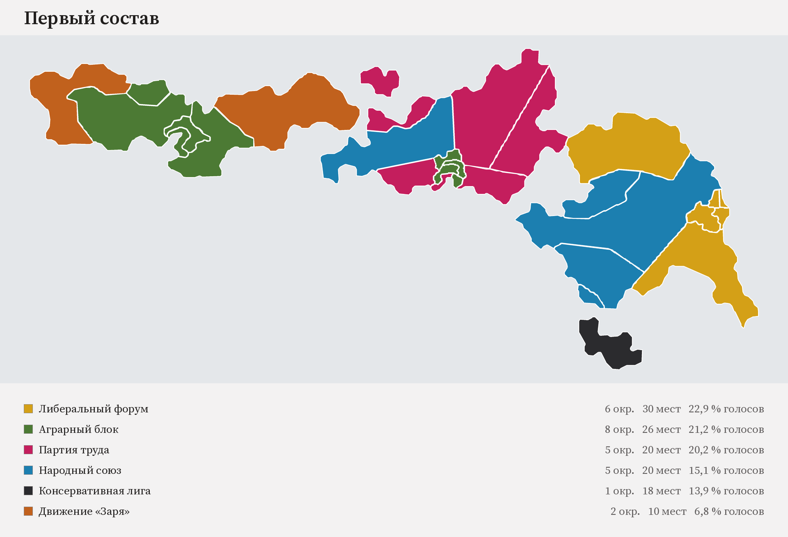
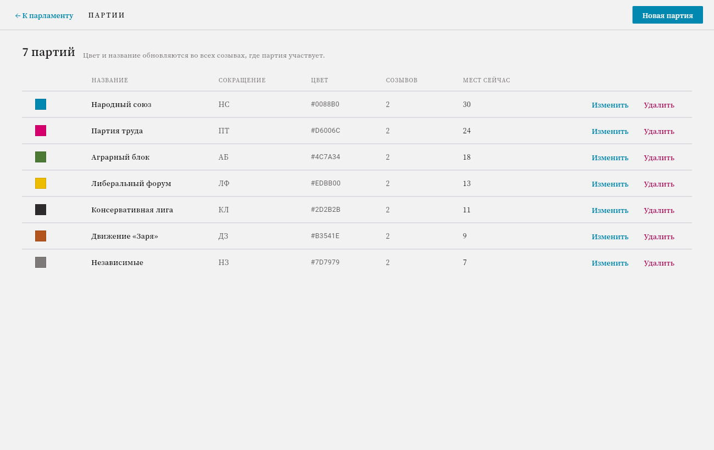
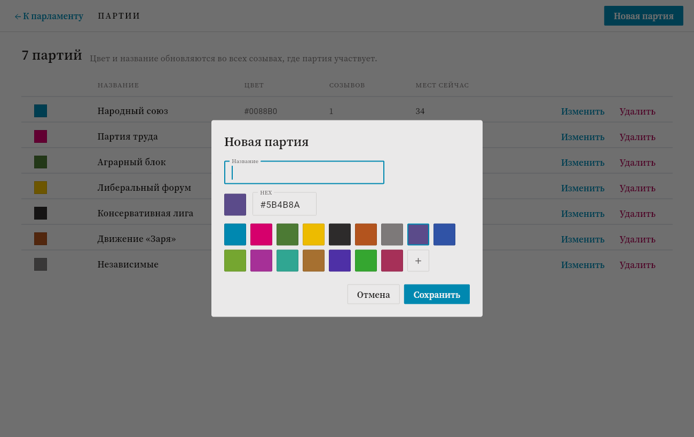
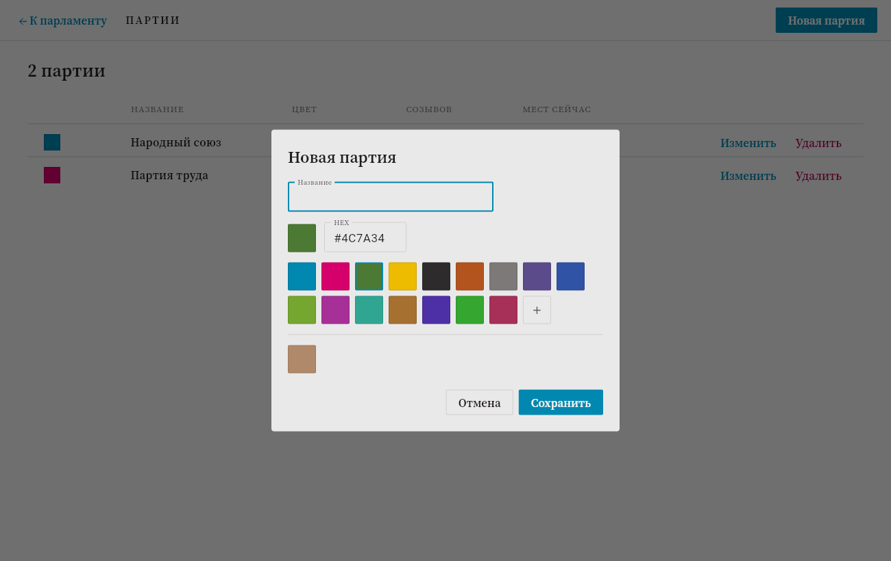
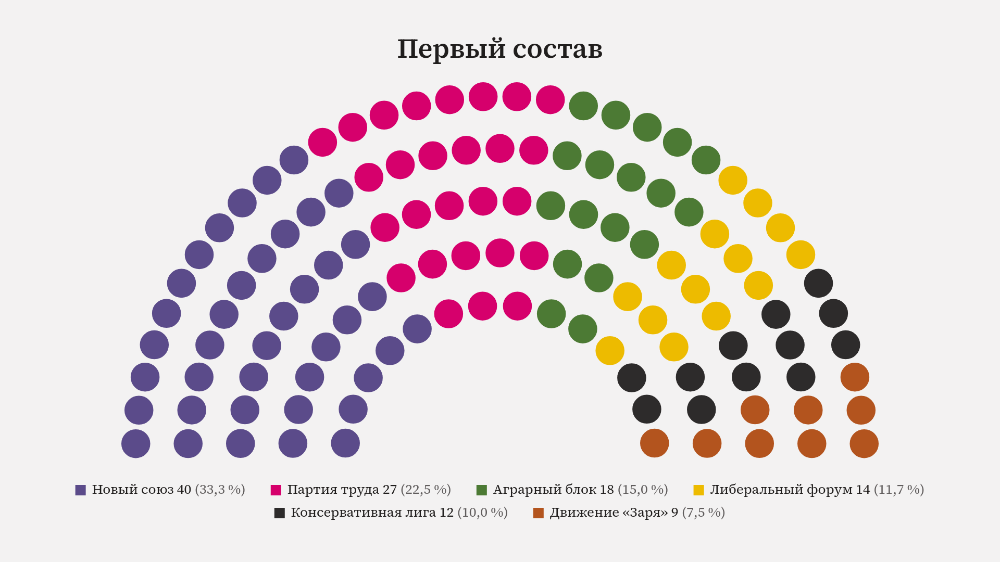

# Парламент

Десктопное приложение для наглядного отображения состава парламента в ролевой
игре: справочник партий, выборы по округам, распределение 124 мандатов,
полукруглая схема зала, карта архипелага, история созывов и экспорт в PNG.



*Карта, выгруженная самой программой: округа покрашены в цвет победившей
партии.*

## Что умеет

- **Справочник партий** — название и цвет: палитра на 16 готовых оттенков,
  ввод HEX или свой цвет через квадрат «насыщенность × яркость» с полосой
  тона — так же, как открывался системный выбор цвета в браузерной версии.
  Последние подобранные вручную цвета (до десяти) предлагаются отдельной
  строкой в следующих диалогах — не нужно каждый раз подбирать заново для
  похожих партий; список сохраняется в файле проекта и переживает перезапуск
  приложения. Правки расходятся по всем созывам, где партия участвует.
  Перед удалением партии видно, что уйдёт вместе с ней: места в созывах,
  очки популярности в населённых пунктах и её доля в разыгранных округах.
- **Распределение мест** — по полю ввода на партию; схема, легенда, остаток и
  полоса прогресса пересчитываются на лету. Сумму нельзя увести выше размера
  палаты, отрицательные числа и буквы не принимаются. После выборов поля
  ввода уступают место списку итогов: места посчитаны по округам, и правка их
  руками развела бы зал с картой. Кнопка «Сбросить выборы» возвращает ручной
  набор, не трогая населённые пункты и очки поддержки.
- **Выборы по округам** — 27 округов игровой карты на 124 мандата. Голоса не
  вводятся, а разыгрываются: каждой партии в округе выпадает 1–10, к броску
  прибавляются модификаторы, и эти числа делятся между партиями
  пропорционально. Модификаторы — средняя поддержка по населённым пунктам и
  свободный модификатор, который выставляет ведущий вручную (любое число,
  отрицательное работает как штраф; причина не привязана к чему-то одному —
  дебаты, скандал, что угодно по ходу партии). Кнопка «Убрать все
  модификаторы» разом чистит выставленные вручную числа по всем округам.
  Места округа делятся по методу наибольших остатков; если борьбы не было,
  победитель забирает весь округ.
- **Поддержка** — у населённого пункта шесть очков неформальной
  популярности, которые делятся между партиями; городские округа одного
  города (Саттмалвик, Гаффинсвик, Триединсборг, Нивенсхолл) делят один общий
  запас на всех — двенадцать очков, потому что город сам себе населённый
  пункт и людей в нём больше, а несколько избирательных округов одного
  города — не повод плодить копилки. Из очков считается модификатор: сумма
  очков партии, делённая на число пунктов. Список пунктов идёт с карты и
  правится только переименованием (щелчком по названию) и очками — заводить
  или убирать пункты из интерфейса нельзя. Заполнять по одному полю не
  обязательно: кнопка «Шаблон таблицы» выгружает CSV со всеми округами и
  колонкой на партию, а «Загрузить таблицу» читает его обратно и проставляет
  очки.
- **Карта** — округа нарисованы своими границами и красятся в цвет
  победившей партии. Клик по округу показывает разбор: бросок, модификаторы,
  проценты и места. Отсюда же открываются выборы и поддержка. Карту можно
  выгрузить в PNG. Проект, начатый до появления карты, округов не получает
  молча — их предлагается добавить кнопкой, потому что вместе с ними
  меняется размер палаты. Проекты, начатые до появления номеров округов,
  чинятся при открытии сами: номер восстанавливается по названию, и карта
  снова рисуется.
- **Созывы** — «Новый созыв» фиксирует текущий состав в истории и открывает
  следующий. Любой прошлый созыв можно открыть, посмотреть и при желании
  поправить — правки сохраняются в него же, но сперва нужно нажать «Править
  состав»: до этого созыв в истории только читается, и выборы в нём не
  переиграть. Ошибочно созданный созыв можно
  удалить из истории — крестик у карточки в левой панели (кроме последнего
  оставшегося: без единственного открытого созыва проект не бывает).
- **Экспорт в PNG** — схема зала в 1920×1080, 2560×1440 или 3840×2160, с
  легендой и названием созыва по выбору; карта — отдельной кнопкой на своём
  экране.
- **Файл проекта** — всё хранится в одном JSON-файле, который лежит в стандартной
  папке приложения и сохраняется сам после каждого изменения; вручную выбирать
  или переключать файл не нужно. Если файл окажется испорчен, программа не
  затрёт его чистым проектом, а отложит рядом под именем `…broken-<дата>` и
  скажет, куда положила.

## Как запустить

Нужен Python 3.10 или новее.

```bash
pip install -r requirements.txt
python main.py
```

### Тесты

```bash
python -m unittest discover -s tests
```

276 тестов: бизнес-логика (валидация мест, справочник, созывы, удаление созыва,
выборы по округам, бросок с модификаторами, поддержка в НП и городах, разбор таблицы
поддержки, свои цвета, файл проекта),
геометрия схемы, экспорт PNG и сам интерфейс — экраны и диалоги прогоняются
через настоящий `ParlamentApp` на подставной странице (`tests/fake_page.py`),
без запуска окна.

### Сборка под Windows

```bash
flet build windows
```

Готовое приложение появится в `build/windows` — папкой (exe и рядом DLL и
`data/`), так собирает любое Flutter-приложение. Для сборки нужен Flutter SDK
и Visual Studio с рабочей нагрузкой «Разработка классических приложений на
C++» — требования самого Flet, см. [его документацию](https://flet.dev/docs/publish/windows).

Не хотите ставить Flutter и Visual Studio локально — в репозитории есть
workflow `.github/workflows/build-windows.yml`: ручной запуск (вкладка
Actions → Build Windows EXE → Run workflow) собирает то же самое на
`windows-latest` и публикует как GitHub Release единым файлом
`ParlamentSetup.exe` — обычный инсталлятор (Inno Setup, скрипт в
`packaging/windows/installer.iss`): ставит приложение в Program Files,
добавляет ярлык в «Пуск» и делает деинсталлятор, пользователю виден только
один файл. Не самораспаковывающийся SFX-архив — такие exe (тихо
распаковывает и запускает другой exe из временной папки) антивирусы
массово принимают за троян-дроппер по поведению, даже без единой
вредоносной строчки внутри; обычный мастер установки под эту эвристику не
подпадает.

## Архитектура

Один процесс Python: Flet рисует окно, бизнес-логика вызывается напрямую —
ни сети, ни межпроцессного обмена.

```
main.py                     точка входа, путь к файлу проекта
parlament/
  model.py                  партия, созыв, округ, НП, проект; сериализация
  elections.py              бросок, модификаторы, деление мест округа
  district_seed.py          округа игровой карты: названия, места, регионы
  district_geometry.py      полигоны округов (генерируется из SVG)
  support_import.py         разбор таблицы поддержки: округа, НП, очки
  store.py                  файл проекта: чтение и атомарная запись
  service.py                операции и валидация; автосохранение
  ui/
    app.py                  состояние, экраны, действия
    parties_view.py         справочник партий
    dialogs.py              диалоги: партия, удаление, созыв, экспорт, справка
    seat_chart.py           геометрия полукруглой схемы и Canvas
    map_view.py             экран карты: округа и сводка по партиям
    map_chart.py            холст карты: полигоны и попадание клика
    map_export.py           отрисовка карты в PNG (Pillow)
    elections_view.py       экран выборов: модификаторы по округам
    support_view.py         экран поддержки: НП и очки популярности
    support_file.py         чтение таблицы с диска и выгрузка шаблона
    export.py               отрисовка PNG (Pillow)
    theme.py                токены дизайн-системы Broadsheet
    format.py               склонения, проценты, даты
    mount.py                безопасное обновление контролов
assets/fonts/               Source Serif 4 — приложению не нужен интернет
tools/
  build_district_geometry.py  генератор полигонов из okruga.svg
packaging/windows/
  installer.iss               скрипт Inno Setup для сборки ParlamentSetup.exe
```

Слой данных (`model`, `store`, `service`) не знает про Flet: его можно
покрыть тестами и переиспользовать под любым интерфейсом.

**Геометрия схемы.** Места лежат на пяти концентрических дугах между
внутренним и внешним радиусом. Мест в ряду — пропорционально длине дуги,
остаток от округления достаётся рядам с наибольшей дробной частью; внутри
ряда места стоят через равный угол, затем все сортируются по углу слева
направо и последовательно красятся цветами партий. Расчёт (`compute_seats`)
отделён от отрисовки, поэтому окно и экспорт в PNG показывают одно и то же.

**Перерисовка.** Смена вида, созыва или списка партий пересобирает экран
целиком; ввод числа мест обновляет только зависимые части (схема, легенда,
сводка, список созывов) — на схеме 240 фигур, и перестраивать всё окно на
каждое нажатие клавиши было бы заметно.

## Формат файла проекта

Обычный JSON в UTF-8 — его можно читать и править руками:

```json
{
  "schemaVersion": 2,
  "totalSeats": 124,
  "rows": 5,
  "parties": [
    { "id": "p1a2b3", "name": "Народный союз", "color": "#0088b0", "abbr": "НС" }
  ],
  "convocations": [
    {
      "id": "c9f8e7",
      "number": 1,
      "name": "Первый состав",
      "seats": { "p1a2b3": 34 },
      "createdAt": "2026-03-12T10:00:00+00:00",
      "fixedAt": "2026-05-04T18:30:00+00:00",
      "votes": { "d5c4b3": { "p1a2b3": 5200 } }
    }
  ],
  "districts": [
    { "id": "d5c4b3", "name": "Гаффинсвик центр", "seats": 10,
      "region": "Гаффинсвик", "x": 0.56, "y": 0.395 }
  ],
  "recentColors": ["#8844aa"]
}
```

Запись атомарная (через временный файл рядом с целевым), так что сбой посреди
сохранения не оставит обрезанный файл. Если файл всё же испортился,
приложение запустится с чистым проектом и скажет об этом.

Приложение всегда работает с одним и тем же файлом по умолчанию:

| ОС | Путь |
|---|---|
| Windows | `%APPDATA%\Parlament\parlament.parlament.json` |
| macOS | `~/Library/Application Support/Parlament/…` |
| Linux | `~/.local/share/Parlament/…` |

Переключить файл из интерфейса нельзя — только один активный проект. Чтобы
вести параллельную игру или сделать резервную копию, файл можно скопировать
или подменить вручную (при закрытом приложении) — формат тот же, что описан
выше.

## Экраны

| | |
|---|---|
|  |  |
| Справочник партий | Создание и правка партии |
|  |  |
| Подбор своего цвета | Схема зала, выгруженная в PNG |

Снимков главного экрана и карты в репозитории нет намеренно: прежние сняты
с браузерной версии на 120 мест, и показывать их как нынешний вид программы
значило бы вводить в заблуждение. Вместо них — то, что программа выгружает
сама: [схема зала](docs/screenshots/export-result.png) и
[карта](docs/screenshots/map-export.png).

## Решения по открытым вопросам ТЗ

Раздел 9 технического задания оставлял пять вопросов открытыми. Решения,
заложенные в реализацию:

1. **Правка прошлых созывов** — разрешена. Архивный созыв открывается только на
   чтение, кнопка «Править состав» снимает защиту; правки сохраняются в тот же
   созыв, новый не создаётся.
2. **Удаление созыва** — реализовано (в макетах было явно вне области работ,
   но продуктовое решение изменилось по ходу разработки). Крестик у карточки
   в левой панели, кроме единственного оставшегося созыва — история не может
   опустеть. Оставшиеся созывы перенумеровываются; автосгенерированные
   названия («Третий состав») пересчитываются под новый номер, а
   переименованные вручную — нет. Если удаляют текущий (открытый) созыв, для
   правки снова открывается предыдущий по времени.
3. **Имя файла при экспорте** — подставляется автоматически по шаблону
   `Парламент_<Название созыва>.png`, поле редактируемое.
4. **Партии между созывами** — остаются в справочнике, даже если в новом составе
   не получили мест. Справочник живёт отдельно от созывов.
5. **Максимум партий** — жёсткого ограничения нет: легенда переносится по
   строкам, а в экспорте строки центрируются, так что читаемость сохраняется и
   на полутора десятках партий.

## Лицензия

MIT.
