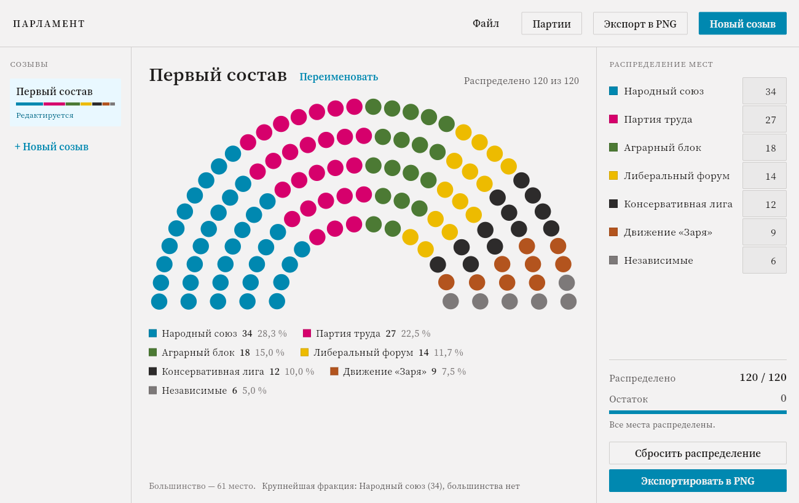

# Парламент

Десктопное приложение для наглядного отображения состава парламента в ролевой
игре: справочник партий, распределение 120 мест, полукруглая схема зала,
история созывов и экспорт картинки в PNG.



## Что умеет

- **Справочник партий** — название, сокращение и цвет (палитра RGB или ввод HEX).
  Правки расходятся по всем созывам, где партия участвует.
- **Распределение мест** — по полю ввода на партию; схема, легенда, остаток и
  полоса прогресса пересчитываются на лету. Сумму нельзя увести выше 120,
  отрицательные числа не принимаются.
- **Созывы** — «Новый созыв» фиксирует текущий состав в истории и открывает
  следующий. Любой прошлый созыв можно открыть, посмотреть и при желании
  поправить — правки сохраняются в него же.
- **Экспорт в PNG** — 1920×1080, 2560×1440 или 3840×2160, с легендой и
  названием созыва по выбору.
- **Файл проекта** — всё хранится в одном JSON-файле и сохраняется само после
  каждого изменения. Через «Файл» можно завести отдельный файл под каждую игру.

## Как запустить

Нужны Node.js 18+ и Python 3.9+.

```bash
npm install
npm start
```

Если Python установлен не как `python` в PATH, путь можно указать явно:

```bash
PARLAMENT_PYTHON=/usr/bin/python3.11 npm start
```

### Тесты

```bash
npm test          # 42 теста бизнес-логики (unittest, без зависимостей)
npm run test:ui   # 61 сквозная проверка: поднимает окно и проходит сценарии ТЗ
```

Сквозная проверка работает с настоящим приложением — тем же `electron/main.js`
и тем же Python-бэкендом — и по ходу складывает скриншоты экранов в
`dist/ui-smoke/`.

### Сборка установщика для Windows

```bash
pip install pyinstaller
npm run dist
```

Сначала PyInstaller собирает бэкенд в `build/dist/backend/parlament-backend.exe`,
затем electron-builder кладёт его в ресурсы приложения и делает
NSIS-установщик в `dist/`.

## Архитектура

```
Electron (интерфейс)                     Python (логика и данные)
┌───────────────────────────┐            ┌────────────────────────────┐
│ renderer/  окно, схема,   │            │ parlament/service.py       │
│            экспорт PNG    │            │   операции и валидация     │
│      ▲                    │            │ parlament/model.py         │
│      │ contextBridge      │            │   партии, созывы, проект   │
│ electron/preload.js       │            │ parlament/store.py         │
│      │                    │            │   файл проекта (JSON)      │
│ electron/main.js  ────────┼── stdio ──▶│ parlament/rpc.py           │
│   окно, меню, диалоги     │  JSON/стр. │   разбор запросов          │
└───────────────────────────┘            └────────────────────────────┘
```

Обмен идёт построчными JSON-сообщениями через stdin/stdout дочернего
процесса — без локального порта, поэтому Windows не спрашивает про
брандмауэр и на машине не появляется лишний слушающий сокет. Бэкенд
использует только стандартную библиотеку Python.

Источник правды — бэкенд: каждая мутация возвращает состояние целиком, и окно
перерисовывается из него. Исключение — поля ввода мест: там правка применяется
сразу локально (схема обязана пересчитываться мгновенно), а на бэкенд уходит
через четверть секунды одним пакетом.

| Что | Где |
|---|---|
| Окно, меню, системные диалоги, запись PNG | `electron/main.js`, `electron/menu.js` |
| Мост к Python (запуск, протокол, таймауты) | `electron/backend.js` |
| Узкий API для окна | `electron/preload.js` |
| Состояние и действия интерфейса | `renderer/js/store.js`, `renderer/js/app.js` |
| Геометрия полукруглой схемы | `renderer/js/seat-chart.js` |
| Отрисовка PNG на canvas | `renderer/js/export-png.js` |
| Экраны и диалоги | `renderer/js/views/` |
| Бизнес-логика и хранение | `backend/parlament/` |

Оформление — дизайн-система Broadsheet из макетов: токены и компоненты лежат
в `renderer/css/broadsheet.css`, шрифт Source Serif 4 вшит в `renderer/fonts`,
чтобы приложение выглядело одинаково без интернета.

## Формат файла проекта

Обычный JSON в UTF-8 — его можно читать и править руками:

```json
{
  "schemaVersion": 1,
  "totalSeats": 120,
  "rows": 5,
  "parties": [
    { "id": "p1a2b3", "name": "Народный союз", "color": "#0088b0", "abbr": "НС" }
  ],
  "convocations": [
    {
      "id": "c9f8e7",
      "number": 1,
      "name": "Первый состав",
      "seats": { "p1a2b3": 34 },
      "createdAt": "2026-03-12T10:00:00+00:00",
      "fixedAt": "2026-05-04T18:30:00+00:00"
    }
  ]
}
```

Запись атомарная (через временный файл рядом с целевым), так что сбой посреди
сохранения не оставит обрезанный файл. Если файл всё же испортился,
приложение запустится с чистым проектом и скажет об этом.

## Решения по открытым вопросам ТЗ

Раздел 9 технического задания оставлял пять вопросов открытыми. Решения,
заложенные в реализацию:

1. **Правка прошлых созывов** — разрешена. Архивный созыв открывается только на
   чтение, кнопка «Править состав» снимает защиту; правки сохраняются в тот же
   созыв, новый не создаётся.
2. **Удаление созыва** — не реализовано (в макетах явно вне области работ).
   История только пополняется. Добавить несложно: `service.py` — операция
   удаления с перенумерацией, дальше вызов из левой панели.
3. **Имя файла при экспорте** — подставляется автоматически по шаблону
   `Парламент_<Название созыва>.png`, поле редактируемое.
4. **Партии между созывами** — остаются в справочнике, даже если в новом составе
   не получили мест. Справочник живёт отдельно от созывов.
5. **Максимум партий** — жёсткого ограничения нет: легенда переносится по
   строкам, а в экспорте строки центрируются, так что читаемость сохраняется и
   на полутора десятках партий.

## Лицензия

MIT.
